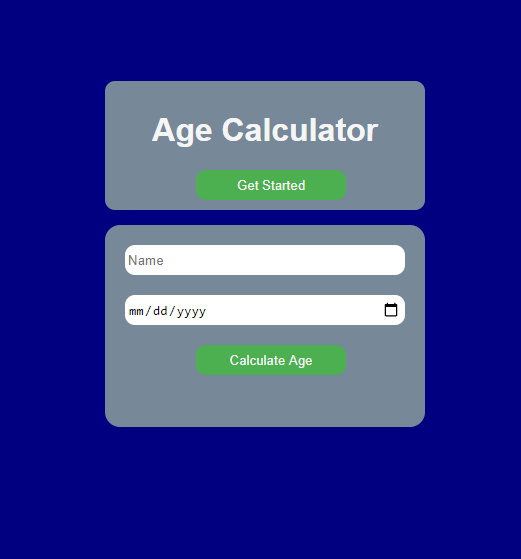

# Age Calculator
Age calculator is an online calculator that calculate and tell your the number of month, days, hours, and seconds you live.
## Live demo
See project live here (https://raw.githack.com/Musa-1995/Project_new/master/index.html)
## Functionalities
This is a one page application.
### Features
* Collect user name.
* Collect Date of birth.
  * Calculate the number of days lived.
  *  Display the user name and age.
  * Display the number of days lived.
  *  Display the hours and seconds lived.
## The prototype of the app

## Developed with
HTML,CSS and JavaScript.
# Editor used
Vscode.
